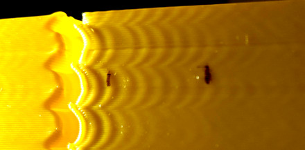
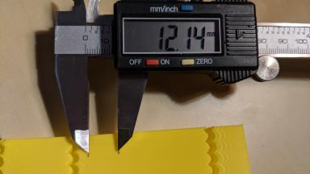
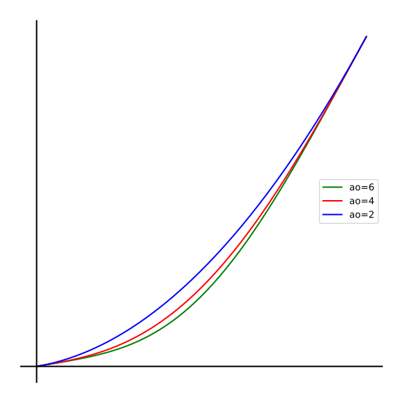
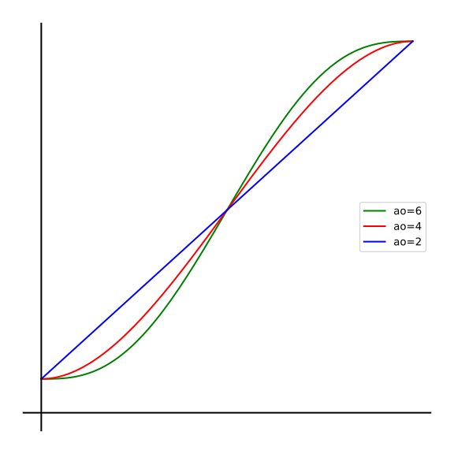
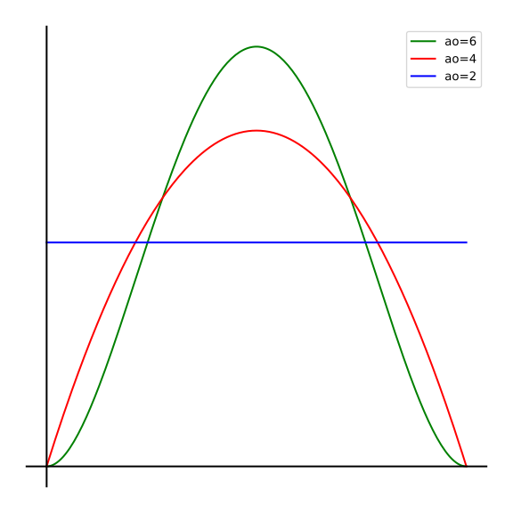
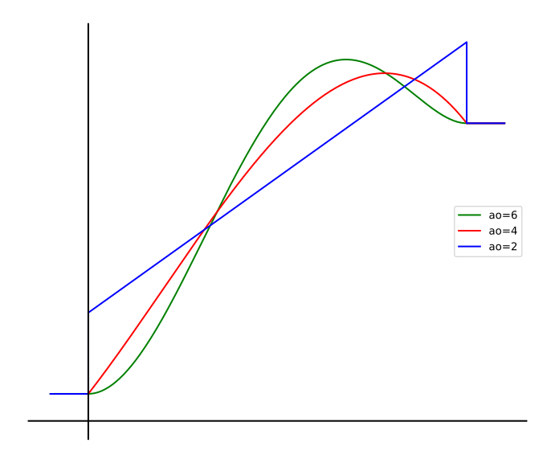
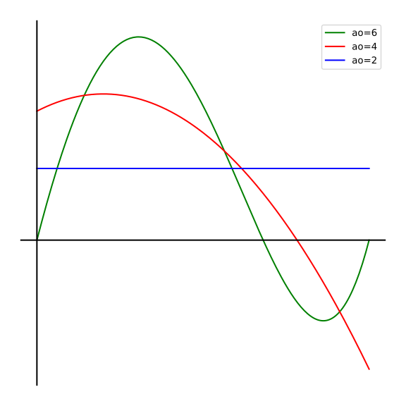

S-Curve acceleration
====================

This document provides an overview of a special mode of acceleration implemented
in Klipper called S-Curve acceleration. This acceleration scheme replaces the
traditional "[trapezoid generator](Kinematics.md#trapezoid-generator)" by modeling higher-order derivatives, like
jerk, snap and so forth, depending on the S-Curve order, using Bezier polynomials.

**Warning**: S-Curve support is experimental. You should consider using high
order acceleration only if you already have some problems with the prints,
otherwise it is not advised to switch over from the default
acceleration_order = 2. Examples of problems S-Curve acceleration may help with:

* Ghosting and ringing in the prints
* Extruder skipping steps or rattling when using
  [Pressure Advance](Pressure_Advance.md):
    * bowden extruder with high pressure advance value
    * direct extruder with high gear ratio (e.g. remote direct drive extruder)

The improvements do not come for free: your prints will likely slow down.
Depending on the model and print parameters, slow down can be from negligible
to 2x and more. On the other hand, the same level of improvements usually cannot
be obtained just by reducing the acceleration.

Note that ghosting usually has mechanical origins: insufficiently rigid printer
frame, non-tight or too springy belts, alignment issues of mechanical parts,
heavy moving mass, etc. Those should be checked and fixed first.

## Acceleration compensation

As the toolhead accelerates or decelerates, it can deviate from the commanded
trajectory due to flex in belts and small frame deformations. When accelerating,
it usually 'lags' from the commanded position, and when decelerating -
overshoots it a bit (illustration with ringing at 40 Hz):


This effect can impact the quality of the corners even at very small corner
velocities and increase the ringing. S-Curve acceleration has an experimental
mode called acceleration compensation which can help to mitigate this issue to
some degree. The approach has certain limitations:

- Works well only if the resonance frequencies on X and Y axes are sufficiently
  close (the difference between min and max frequency should be not larger than
  around 30-40%);
- It is rather sensitive to tuning the compensation parameter (unlike jerk
  limit), it should preferably be within ~20% of optimal value for each axis;
- Can compensate only acceleration along the move direction, does not handle
  centripetal acceleration;
- Supports well only AO=6; although AO=4 is also implemented, it is not so much
  recommended.

On the positive side, it works for printers with any kinematics.


Enable S-Curve acceleration
===========================

To try experimental S-Curve acceleration mode with jerk limit in your existing
Klipper installation, SSH to your Raspberry Pi and run the following commands:
```
$ cd klipper
$ sudo service klipper stop
```

Configure the new Git remote:
```
$ git remote add s-curve-exp https://github.com/dmbutyugin/klipper.git
$ git remote -v
```
The output should list the new remote among other things:
```
s-curve-exp	https://github.com/dmbutyugin/klipper.git (fetch)
s-curve-exp	https://github.com/dmbutyugin/klipper.git (push)
```

Now check the current branch, it will be needed to roll back after you are
finished with the experiments:
```
$ git branch
```
will most likely list
```
* master
```

Check out the new branch:
```
$ git fetch s-curve-exp
$ git checkout s-curve-exp/scurve-c-combine-smoothpa
```

Add `acceleration_order` paramter to your `printer.cfg`
configuration file:

```
[printer]
acceleration_order: 6  # or 4
```

Start Klipper:
```
$ sudo service klipper start
```

If you want to switch back to the main Klipper branch, SSH to your Raspberry
Pi and run the following commands:
```
$ cd klipper
$ sudo service klipper stop
$ git checkout master
$ sudo service klipper start
```

S-Curve acceleration tuning
===========================

The quality of the prints when using S-Curve acceleration depends on a
few parameters:

* Maximum jerk (if S-Curve is enabled)
* Acceleration order
* Acceleration compensation (optional)

Maximum acceleration and maximum velocity do not have significant impact
on the ringing in this mode and can be set to the values suggested by the
printer manufacturer or the values you normally use. You do not need to
tune these. It is also not advised to increase the square corner velocity above
the default value (5 mm/s): increasing it does not significantly reduce the
print time, and can severely amplify the ringing and degrade the quality of
the prints.

## Tuning process

Prepare the [test](https://www.thingiverse.com/thing:3847206) model in the slicer:

 * Suggested layer height is 0.2 or 0.25 mm.
 * Infill and top layers can be set to 0.
 * Use 1-2 perimeters, or even better the smooth vase mode with 1-2 mm base.
 * Use sufficiently high speed, around 80-100 mm/sec, for *external* perimeters.
 * Make sure that the minimum layer time is *at most* 5 seconds.

### Ringing frequency

First, measure the **ringing frequency**. For best results, this should be
done with acceleration_order = 2 and high acceleration.

1. Start with the following command `SET_VELOCITY_LIMIT ACCEL_ORDER=2`.
2. Print the test model sliced with suggested parameters.
3. If the ringing is poorly visible, try increasing acceleration with
   `SET_VELOCITY_LIMIT ACCEL=3000` or higher. Basically, you need to *decrease*
   the quality of the print.
4. Measure the distance *D* (in mm) between *N* oscillations along X axis near
   the notches, preferably skipping the first oscillation or two. To measure
   the distance between oscillations more easily, mark the oscillations first,
   then measure the distance between the marks with a ruler or calipers:

    |||
    |:--:|:--:|

5. Compute the ringing frequency = *V* &middot; *N* / *D* (Hz) where *V* is
   the velocity for outer perimeters (mm/sec).
6. Do (4) - (5) for Y axis as well.

For Cartesian printers, you will obtain 2 frequencies, which may be different,
esepcially on bed-slinger printers. For CoreXY printers, repeat the process
(1)-(6) rotating the model 45 degrees around Z axis such that the angle between
the X and Y axes and the sides of the model is 45 degrees; you will get 4
frequencies in total. Delta printers should have 3 frequencies close to each
other; just measure 2 frequencies as for Cartesian printers.

Ringing frequency can depend on the position of the model within the buildplate
and Z height; you can check if you see the differences in frequencies at
different positions along the sides of the test model and at different heights.
On the other hand, the measurements do not have to be very precise, and some
variations in the ringing frequencies are tolerable.

If you got frequencies sufficiently close to each other, you can simply use
the average or the minimum frequency from here. For example, if you got 40 Hz and
60 Hz, 50 Hz average will do. If you got very different frequencies, either use
the smallest (it typically shows the worst ringing), or refer to
[fine tuning](#advanced-fine-tuning-and-troubleshooting).

Now compute `min_jerk_limit_time` parameter as 1.0 / ringing_frequency. Add
the result to the config, e.g.
```
[printer]
min_jerk_limit_time: 0.02  # in sec, corresponds to 50 Hz
```
and restart Klipper using `RESTART` command.

You can re-print the model to check if the quality has improved.

### Pressure Advance

If you use Pressure Advance, it may need to be re-tuned. Follow the
[instructions](Pressure_Advance.md#tuning-pressure-advance) to find the
new value, if it differs from the previous one.

If during the testing you notice that extruder rattles or skip steps, it
means that you may need to reduce `max_jerk` value explicitly. Follow the
suggestions in [fine tuning](#advanced-fine-tuning-and-troubleshooting) section.

### Advanced fine tuning and troubleshooting

There is additional configuration parameter you may need to change if your
printer has very different ringing frequencies, if it cannot keep up
with Pressure Advance, or if you want a different tradeoff between the
quality and the print time. You can additionally configure max jerk parameter:
```
[printer]
max_jerk: ...
```

For a single ringing frequency the suggested max_jerk value is
6 &middot; max_accel &middot; ringing_frequency / RINGING_REDUCTION_FACTOR, with
RINGING_REDUCTION_FACTOR ~ 10.0. If the ringing frequencies are very different,
set

 * min_jerk_limit_time = 1.0 / max_ringing_frequency
 * max_jerk = 0.6 &middot; max_accel &middot; min_ringing_frequency

If you still see poor quality prints after measuring
[ringing frequency](#ringing-frequency) and setting min_jerk_limit_time,
set max_jerk in `[printer]` section explicitly. Then you can try to
decrease min_jerk_limit_time and/or max_jerk values. min_jerk_limit_time impacts
the acceleration of short moves, and max_jerk parameter has effect on all moves.

If you want to decrease print times, you can try increasing max_jerk.
It is not recommended to increase min_jerk_limit_time significantly above
1.0 / min_ringing_frequency value to avoid ringing around resonances.

If extruder struggles with Pressure Advance on very short moves, decrease
min_jerk_limit_time. If there are problems on longer moves and higher
velocity changes, decrease max_jerk value.

Keep in mind that there is no well-defined upper limit on the maximum jerk
value, except when using Pressure Advance. Still, the practical range of values
to choose max_jerk from is from 10'000 mm/sec^3 to around 100'000 - 1'000'000
mm/sec^3 depending on the printer setup and hardware.

### Acceleration compensation tuning

The feature is controlled by `accel_compensation` parameter in `[printer]`
section, or via `SET_VELOCITY_LIMIT ACCEL_COMPENSATION=...` command. The theory
suggests the best value for accel_compensation = 1 / (2 π f)^2 with f - the
resonance (ringing) frequency. For example, for 50 Hz ringing frequency
accel_compensation ~= 0.00001 (sec^2). If the ringing frequencies are different,
choose a value in between, closer to higher frequency - this will overcompensate
the higher frequency, and undercompensate the lower frequency. Still, it is
better to fine-tune this parameter to get the best results.

**Tuning process**

Some prerequisites:

- measure the ringing frequency(-ies) as described above;
- compute `min_jerk_limit_time` and `max_jerk` for the baseline;
- store these parameters in the config.

NB: acceleration compensation improves toolhead cornering. If Pressure Advance
was enabled, it is advised to disable it for acceleration compensation tuning.
Once it is tuned, Pressure Advance can be re-enabled, but it is better to
[tune](Pressure_Advance.md#tuning-pressure-advance) PA value afterwards: there
is a good chance that slightly lower PA value will be needed.

Now set the desired acceleration and acceleration order (6 is suggested), e.g.:
`SET_VELOCITY_LIMIT ACCEL=5000 ACCEL_TO_DECEL=3000 ACCEL_ORDER=6`. Set very high
max jerk parameter, e.g. `SET_VELOCITY_LIMIT JERK=1000000`. Print the test model
increasing the acceleration compensation every 5 mm. It is a good idea to cover
at least the range of values [0.5 / (2 π f<sub>max</sub>)<sup>2</sup>,
1.5 / (2 π f<sub>min</sub>)<sup>2</sup>]. For example, if the printer has
ringing frequencies 30 Hz and 50 Hz it is good to cover ~ [0.000005, 0.00004]:
on the test model of 60 mm height, start with
`SET_VELOCITY_LIMIT ACCEL_COMPENSATION=0.000005`, then increase it by
0.000003 every 5 mm. `TUNING_TOWER` command can help with the tuning:
for this example just issue the command `TUNING_TOWER COMMAND=SET_VELOCITY_LIMIT
PARAMETER=ACCEL_COMPENSATION START=0.0000035 FACTOR=0.0000006 BAND=5` at the
beginning of your test print. Note that it is important to use `BAND` parameter
in vase mode, because every move has a different height.

Once a range of promising values for acceleration compensation is determined,
repeat the test on the narrower range to determine the best value that works
reasonably well for both axes. If you do not see any improvement, or ringing
suppression happens at different values for X and Y axis - acceleration
compensation is unlikely to work for your printer.

Notice that if the results on the previous step are not yet perfect - ringing
is suppressed, but only partially - you can still continue to the next step.
Now you need to tune the JERK parameter.

First, you want to determine the reasonable range for jerk to fine-tune later.
Set the chosen acceleration compensation parameter, then print the test model
increasing JERK parameter. For example, one can start with
`SET_VELOCITY_LIMIT JERK=50000` and increase it by 50'000 every 5 mm. Choose the
range of values 50'000 - 100'000 wide such that the min value in that range
still shows good quality results and max value already shows some signs of
ringing (e.g. the chosen range could be 150'000 - 250'000).

Now reprint the test model fine-tuning JERK parameter. Start with the minimum
value determined at the previous step `SET_VELOCITY_LIMIT JERK=...` and increase
it by 10'000 every 5 mm. Choose the highest value that still shows no signs of
ringing. Tuning process is now complete.


S-Curve acceleration overview
=============================

By default, Klipper uses "trapezoid generator" for each move - each move has
a start speed, it accelerates to a cruising speed at constant acceleration,
it cruises at a constant speed, and then decelerates to the end speed using
constant acceleration.


The basic idea behind S-Curve acceleration is to replace the constant
acceleration and deceleration with polynomials of higher order. For some
choices of the polynomials the toolhead will travel the same path and reach
the same speed as if it was accelerating constantly, but higher order
derivatives (e.g. acceleration, jerk) can be 0 in the beginning and at the end
of acceleration depending on the polynomial order, ensuring better smoothness
of the motion.

Klipper currently supports acceleration_order = 2, 4 and 6.
acceleration_order = 2 is the default constant acceleration mode.
Charts below show the distance covered, velocity and acceleration for different
acceleration orders.

||
|:--:|
| *Distance* |
||
| *Velocity* |
||
| *Acceleration* |

Notice that the velocity and acceleration are smoother with higher acceleration
orders. When acceleration is not constant, the 'lack' of acceleration in
the beginning must be compensated with higher max acceleration. Klipper still
plans all moves considering the 'effective' acceleration, which can be seen as
an average acceleration, but then each move is executed using the polynomial
of the chosen degree. Though instantaneous acceleration exceeds the configured
maximum toolhead acceleration, because the movement is smoother overall,
the reduction of the maximum permitted acceleration is usually not necessary.

Besides making the movements smoother, S-Curve acceleration *may* improve the
quality of the prints. One of the theories behind it is that each printer has
limited non-infinite rigidity of the frame, belts, etc. When the force is
applied or relieved instantly in the beginning and at the end of acceleration
or deceleration, the system can act as a spring and start oscillating, which
can be observed in the form of ringing in the prints. S-Curve acceleration
'spreads' increase and decrease of the force during a longer time, potentially
reducing the oscillations.

This has an important consequence: if the short moves are executed with the
same acceleration, the full force must be applied over the shorter period of
time, effectively nullifying the positive effect of S-Curve acceleration on
short moves. That's why Klipper also limits the maximum kinematic jerk
*J* = *da* / *dt* of each acceleration and deceleration in S-Curve acceleration
mode.

For the chosen polynomials, the maximum kinematic jerk *J* is

*J* = 6 *a* / *T*

for acceleration_order = 4, where *a* is effective acceleration and *T* is
acceleration time. For acceleration_order = 6

*J* = 10 *a* / (*T* &#8730;3) &asymp; 5.774 *a* / *T*.

In the end, we use 6 *a* / *T* < max_jerk condition to limit the jerk. This
leads to a cubic equation

(*v*<sup>2</sup> - *v*<sub>0</sub><sup>2</sup>) &times;
  (*v* + *v*<sub>0</sub>) / 2 = *L*<sup>2</sup> *J* / 3,

which can be solved using Cardano's formula to determine the velocity *v*
after acceleration with the maximum jerk *J* over the segment of length *L*.
The final velocity is chosen as a minimum out of that value and
*v*<sub>0</sub> + (2 *a* *L*)<sup>1/2</sup>.

Another reason to limit the jerk is that it directly translates into extruder
acceleration *a*<sub>e</sub> if Pressure Advance is enabled:
*a<sub>e</sub>* = *r P J*,
where *P* is the pressure advance parameter,

*r* = (4 *w* *h*) / (&pi; *D*<sup>2</sup>).

is the extrusion ratio, *D* is the filament diameter, *w* is the extrusion
width, *h* is the layer height. As an example, with *P* = 0.5, *w* = 0.4 mm,
*h* = 0.2 mm, *D* = 1.75 mm, and *J* = 100'000 the extruder acceleration is
1663 mm/sec^2 due to jerk.

Extruder kinematics looks as follows with different acceleration orders:

||
|:--:|
| *Extruder Velocity* |
||
| *Extruder Acceleration* |

Notice the velocity jump with acceleration_order = 2 (the 'infinite'
acceleration spikes at the beginning and the end of acceleration with
acceleration_order = 2 are not shown). With acceleration_order > 2
the velocity is continuous, and for acceleration_order = 6 it is even
smooth.  Thus, acceleration_order > 2 can improve the performance of
the extruder if pressure advance is enabled.


S-Curve acceleration notes
==========
 * S-Curve reduces acceleration of short moves, effectively slowing them down
    * this can be disabled by setting very high `max_jerk` value in the config,
      e.g. 1000000, but this is not advised, unless acceleration compensation
      is enabled
    * jerk limit is not applied to extrude-only moves, they are always executed
      with the full `max_extrude_only_accel` acceleration.
 * When the move must both accelerate and decelerate, and acceleration for the
   move is below `max_accel_to_decel`, Klipper will not generate the traditional
   trapezoid, but will put deceleration right after acceleration. This is not
   much of a problem with acceleration_order > 2 because the transition between
   acceleration and deceleration is smooth anyways (toolhead acceleration is 0
   at the switching point).
 * Instant toolhead acceleration may exceed the configured `max_accel` value.
   `max_accel` serves as a limit for the 'average' acceleration during the move
   with acceleration_order > 2. Still, there is typically no need to reduce
   it, unless the steppers start skipping steps.
 * S-Curve acceleration mode puts less stress on the extruder when pressure
   advance is enabled (unless `max_jerk` is set to a too high value).
 * Klipper stops the toolhead between extrude and non-extrude moves, which, in
   case of S-Curve acceleration, can additionally slow down the prints. Zig-zag
   top/bottom pattern (line/rectilinear in Slic3r), as well as
   'Connect infill lines' setting in Cura can be used when slicing models
   to mitigate this issue to some degree. When these options are enabled,
   slicers will generate mostly connected lines at the top, bottom and infill,
   preventing toolhead from stopping for most of the moves.
